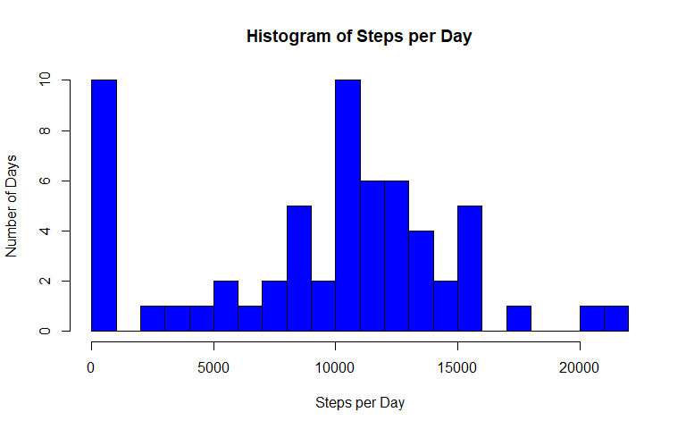
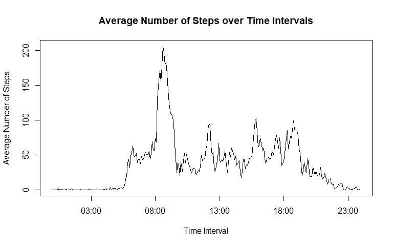
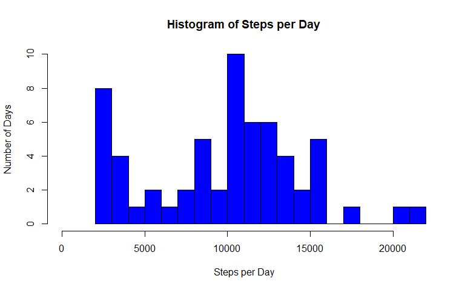
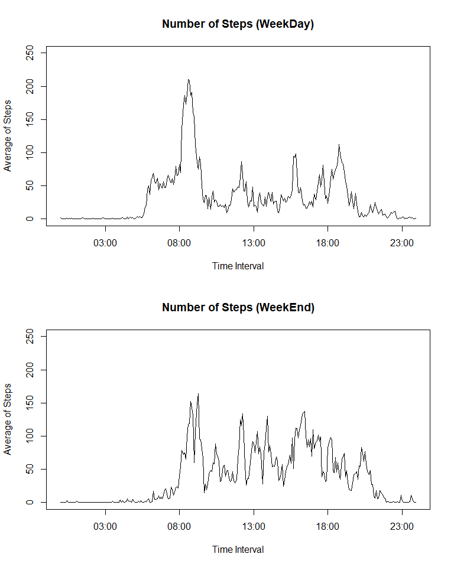

## Loading and preprocessing the data
**1. Load the data (i.e. read.csv())**

```r
if(!file.exists('activity.csv'))
    unzip(zipfile = 'activity.zip')
activity <- read.csv('activity.csv',
                     header = TRUE,
                     stringsAsFactors = FALSE)
```
**2. Process/transform the data (if necessary) into a format suitable for your analysis.**  
Converting character date variable to object of class "Date"

```r
activity$date <- as.Date(activity$date)
```
and mergeing date and interval into a "Date-Time" variable

```r
# activity$time <- sub('^([0-9]{1})$', '0:0\\1', activity$interval)
# activity$time <- sub('^([0-9]{2})$', '0:\\1', activity$time)
# activity$time <- sub('^([0-9]{1})([0-9]{2})$', '\\1:\\2', activity$time)
# activity$time <- sub('^([0-9]{2})([0-9]{2})$', '\\1:\\2', activity$time)
# more elegant
activity$Time <- sprintf("%04d", activity$interval)
activity$Time <- sub('^([0-9]{2})([0-9]{2})$', '\\1:\\2', activity$Time)

require(lubridate)
activity$DateTime <- ymd_hm(paste(activity$date, activity$Time))
activity$Time <- ymd_hm(paste('1900-01-01', activity$Time))
activity$day <- weekdays(activity$date)
```
Now let's have a first look at our data:

```r
str(activity)
```

```
## 'data.frame':	17568 obs. of  6 variables:
##  $ steps   : int  NA NA NA NA NA NA NA NA NA NA ...
##  $ date    : Date, format: "2012-10-01" "2012-10-01" ...
##  $ interval: int  0 5 10 15 20 25 30 35 40 45 ...
##  $ Time    : POSIXct, format: "1900-01-01 00:00:00" "1900-01-01 00:05:00" ...
##  $ DateTime: POSIXct, format: "2012-10-01 00:00:00" "2012-10-01 00:05:00" ...
##  $ day     : chr  "Monday" "Monday" "Monday" "Monday" ...
```

## What is mean total number of steps taken per day?
For this part of the assignment, you can ignore the missing values in the dataset.  
**1. Calculate the total number of steps taken per day**

```r
stepsbyday<- tapply(activity$steps, activity$date, sum, na.rm=TRUE)
```
**2. Make a histogram of the total number of steps taken each day**

```r
hist(stepsbyday,
     breaks = 26,
     col = 'blue',
     main = 'Histogram of Steps per Day',
     xlab = 'Steps per Day',
     ylab = 'Number of Days',
     xlim = c(0,22000))
```

<!-- -->

**3. Calculate and report the mean and median of the total number of steps taken per day**

```r
mean_stepsbyday <- round(mean(stepsbyday),0)
median_stepsbyday <- median(stepsbyday)
```
Steps per Day|Value
-----------|-----
Mean|9354
Median|10395

## What is the average daily activity pattern?
**1.Make a time series plot (i.e. type = "l") of the 5-minute interval (x-axis) and the average number of steps taken, averaged across all days (y-axis)**  
First calculate the average number of steps per 5-minute interval:

```r
require(dplyr)
MeanStepsTime <-
    activity %>%
    group_by(Time) %>%
    summarize(Mean = round(mean(steps, na.rm = TRUE),1)) %>%
    as.data.frame()
```
and then plot it:

```r
plot(MeanStepsTime, 
     type = 'l',
     lwd = 1,
     main = 'Average Number of Steps over Time Intervals',
     xlab = 'Time Interval',
     ylab = 'Average Number of Steps')
```

<!-- -->

**2.Which 5-minute interval, on average across all the days in the dataset, contains the maximum number of steps?**

```r
maxStepsInterval <-
    strftime(MeanStepsTime[which.max(MeanStepsTime$Mean),1],
             format = '%H:%M', tz = 'UTC')
maxSteps <- MeanStepsTime[which.max(MeanStepsTime$Mean),2]
```
The interval at 08:35 contains on average 206.2 steps, which is the maximum.

## Imputing missing values
Note that there are a number of days/intervals where there are missing values (coded as NA). The presence of missing days may introduce bias into some calculations or summaries of the data.  
**1.Calculate and report the total number of missing values in the dataset (i.e. the total number of rows with NAs)**

```r
missing_observations <-
    sum(is.na(activity$steps))
total_observations <-
    length(activity$steps)
missing_percentage <-
    round(missing_observations/total_observations * 100,1)
```
There are 2304 missing observations for variable 'steps', which accounts for 13.1% of the total of 17568 observations.  

**2.Devise a strategy for filling in all of the missing values in the dataset. The strategy does not need to be sophisticated. For example, you could use the mean/median for that day, or the mean for that 5-minute interval, etc.**  

```r
missing_by_date <- 
    activity %>%
    group_by(date) %>%
    summarize(
        observations = n(),
        num_NAs = sum(is.na(steps))) %>%
    as.data.frame()
```
Looking at the distributions we realize that there is missing data for complete days only.

```r
missing_by_date[missing_by_date$num_NAs > 0,]
```

```
##          date observations num_NAs
## 1  2012-10-01          288     288
## 8  2012-10-08          288     288
## 32 2012-11-01          288     288
## 35 2012-11-04          288     288
## 40 2012-11-09          288     288
## 41 2012-11-10          288     288
## 45 2012-11-14          288     288
## 61 2012-11-30          288     288
```
Further on there are a two strange days, namely '2012-10-02' and '2012-11-15' with only two time intervals not equal to zero. Most likely the wearable is on but wasn't used. So best strategy is to impute NA's for 0 values for this special day. Later we can impute a better value.  

```r
activity[(activity$date == as.Date('2012-10-02') | 
              activity$date == as.Date('2012-11-15')) & activity$steps > 0,c(1,2,3,6)]
```

```
##       steps       date interval      day
## 555     117 2012-10-02     2210  Tuesday
## 556       9 2012-10-02     2215  Tuesday
## 13002    33 2012-11-15      325 Thursday
## 13003     8 2012-11-15      330 Thursday
```
I would tend to just disregard the days with missing values. But as we are required in this assignment to impute missing values, the strategy will be to fill the missing values with the median for the specific weekday and time interval.  
**3.Create a new dataset that is equal to the original dataset but with the missing data filled in.**  

```r
activity_imputed <-
    activity %>%
    mutate(steps = ifelse(
        (date == as.Date('2012-10-02') | date == as.Date('2012-11-15')) & 
            steps == 0,
        NA, steps))
activity_imputed <- activity_imputed %>%
    group_by(day, interval) %>%
    mutate(steps = 
               ifelse(is.na(steps), median(steps, na.rm = T), steps)) %>%
    as.data.frame()
```
**4.Make a histogram of the total number of steps taken each day and Calculate and report the mean and median total number of steps taken per day. Do these values differ from the estimates from the first part of the assignment? What is the impact of imputing missing data on the estimates of the total daily number of steps?**  

```r
stepsbyday_imputed<- tapply(activity_imputed$steps, activity_imputed$date, sum, na.rm=TRUE)
```

```r
hist(stepsbyday_imputed,
     breaks = 25,
     col = 'blue',
     main = 'Histogram of Steps per Day',
     xlab = 'Steps per Day',
     ylab = 'Number of Days',
     xlim = c(0,22000))
```

<!-- -->

```r
mean_stepsbyday_imputed <- round(mean(stepsbyday_imputed),0)
median_stepsbyday_imputed <- as.integer(median(stepsbyday_imputed))
```
As we can see in following table the mean increased while the median remained the same. This makes sense because in our before data we faced days with 0 steps. Imputing values for these increased the mean. The median remained the same because it is stable to outliers.  

Steps per Day|Value
-----------|-----
Mean before Imputation  | 9354
Mean after Imputation   | 9814
Median before Imputation| 10395
Median after Imputation | 10395  
## Are there differences in activity patterns between weekdays and weekends?
**1.Create a new factor variable in the dataset with two levels - "weekday" and "weekend" indicating whether a given date is a weekday or weekend day.**  

```r
normal_weekdays <- c("Monday", "Tuesday", "Wednesday", "Thursday", "Friday")
activity_imputed <- 
    activity_imputed %>%
    mutate(day_type = ifelse(day %in% normal_weekdays,
                             'weekday', 'weekend'))
activity_imputed$day_type <- as.factor(activity_imputed$day_type)
```
**2.Make a panel plot containing a time series plot (i.e. type = "l") of the 5-minute interval (x-axis) and the average number of steps taken, averaged across all weekday days or weekend days (y-axis). See the README file in the GitHub repository to see an example of what this plot should look like using simulated data.**  

```r
MeanStepsTime <-
    activity_imputed %>%
    group_by(day_type, Time) %>%
    summarize(Average = round(mean(steps, na.rm = TRUE),1)) %>%
    as.data.frame()
```
Panel Plots contrasting weekdays with weekends data:

```r
par(mfrow=c(2,1))
plot(MeanStepsTime[MeanStepsTime$day_type == 'weekday',2],
     MeanStepsTime[MeanStepsTime$day_type == 'weekday',3],
     type = 'l',
     main = 'Number of Steps (WeekDay)',
     xlab = 'Time Interval',
     ylab = 'Average of Steps',
     ylim = c(0,250))
plot(MeanStepsTime[MeanStepsTime$day_type == 'weekend',2],
     MeanStepsTime[MeanStepsTime$day_type == 'weekend',3],
     type = 'l',
     main = 'Number of Steps (WeekEnd)',
     xlab = 'Time Interval',
     ylab = 'Average of Steps',
     ylim = c(0,250))
```

<!-- -->
